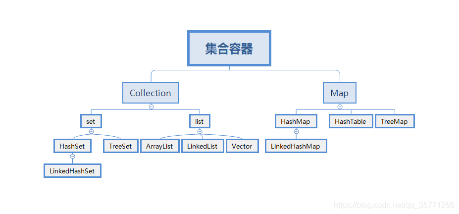
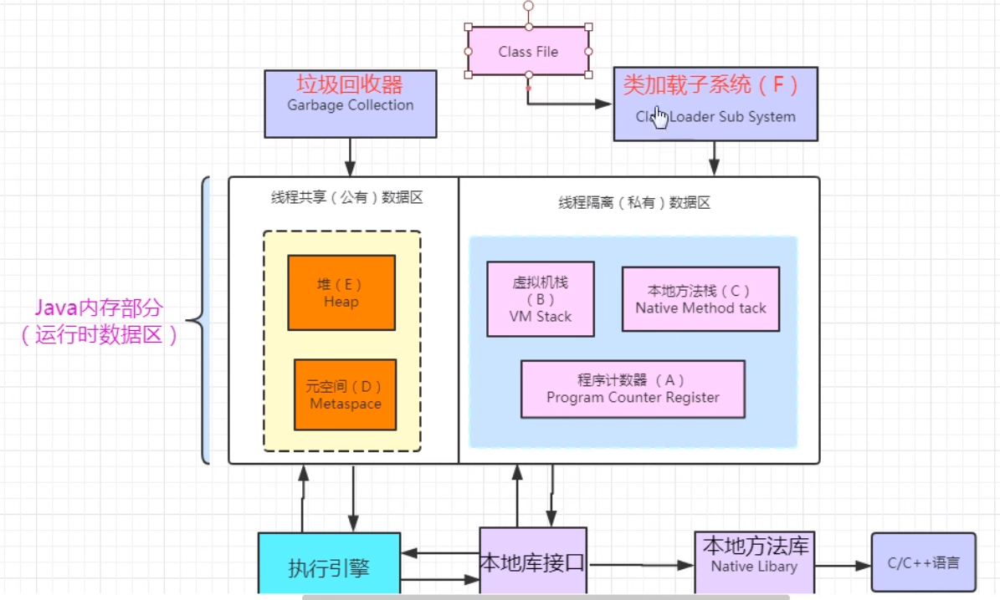
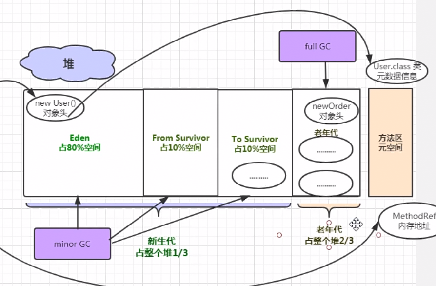

# 0 类与其加载机制和加载器

程序主要有两种运行方式：静态编译与动态解释。静态编译的程序在执行前程序会被提前编译为机器码（或中间字节码），通常将这种类型称为**AOT** （Ahead of time）即 “提前编译”。而解释执行则是在运行时将源码实时翻译为机器码来执行，通常将这种类型称为**JIT**（Just-in-time）即“即时编译”。


## 类及其结构

类头和字段和填充字段

## 类加载（重要）

[查看另一文件](类加载器.md)
## 反射(重要)
[查看反射](反射.md5)

不同类加载器加载的类可以存在同一类名，但不是同一类

# 1.Map解析

## 1.1 HashMap

### 1.1.1 结构

1.数据结构：数组 +链表 + 红黑树(jdk8)


继承自**AbstractMap** 

**2.默认长度是16，扩容时原始长度x2，最消耗性能的点就出现了：原数组中的数据必须重新计算其在新数组中的位置，并放进去，这就是resize，所以使用的时候最好直接指定，防止资源浪费**

3.超过设置的可容纳的**键值对数**（由负载因子决定，默认0.75）时候就会扩容。

4.不保证是有序的，非同步线程不安全

### *1.1.2* put

1.获取hashcode，哈希算法（高位16运算与原低位16异或运算），取模生成key，

2.当key存在时产生hash冲突，生成链表, 节点为node（）。

3.插入时循环遍历链表，尾插法进行插入，如果到达阈值8时转为红黑树。

4.允许key为空

5.hashmap的基本单位为entry，数组中存储的值是entry，数组下标为key的hash取模的值.

### 1.1.3 **get**

hash算法获取下标，比较key内容和hashcode。

### 1.1.4 红黑树

解决链表过长效率低下。**链表超过8时转红黑树**

红黑树插入慢。低于8时多了插入性能低，查询带来的性能提升不足以弥补。

导言：
对于二叉搜索树，如果插入的数据是随机的，那么它就是接近平衡的二叉树，平衡的二叉树，它的操作效率（查询，插入，删除）效率较高，时间复杂度是O（logN）。但是可能会出现一种极端的情况，那就是插入的数据是有序的（递增或者递减），那么所有的节点都会在根节点的右侧或左侧，此时，二叉搜索树就变为了一个链表，它的操作效率就降低了，时间复杂度为O(N)，所以可以认为二叉搜索树的时间复杂度介于O（logN）和O(N)之间，视情况而定。

那么为了应对这种极端情况，红黑树就出现了，它是具备了某些特性的二叉搜索树，能解决非平衡树问题，红黑树是一种接近平衡的二叉树（说它是接近平衡因为它并没有像AVL树的平衡因子的概念，它只是靠着满足红黑节点的5条性质来维持一种接近平衡的结构，进而提升整体的性能，并没有严格的卡定某个平衡因子来维持绝对平衡）。


性质
- 节点是红色或黑色
- 根是黑色
- 叶子节点（外部节点，空节点）都是黑色，这里的叶子节点指的是最底层的空节点（外部节点），**图中的那些null节点才是叶子节点，null节点的父节点在红黑树里不将其看作叶子节点**
- 红色节点的子节点都是黑色
	- 红色节点的父节点都是黑色
	- 从根节点到叶子节点的所有路径上不能有 2 个连续的红色节点
- 从任一节点到叶子节点的所有路径都包含相同数目的**黑色**节点

////////////待补充

## 1.1.4 HashTable，HashSet

**HashMap和HashTable的区别**

相同点：都是存储key-value键值对的

不同点：

- HashMap允许Key-value为null，hashTable不允许；
- 
- hashMap没有考虑同步，是线程不安全的。hashTable是线程安全的，给api套上了一层**synchronized**修饰;
- 
- HashMap继承于AbstractMap类，hashTable继承与Dictionary类。
- 
- 迭代器(Iterator)。HashMap的迭代器(Iterator)是fail-fast迭代器，而Hashtable的enumerator迭代器不是fail-fast的。所以当有其它线程改变了HashMap的结构（增加或者移除元素），将会抛出ConcurrentModificationException。
- 
- 容量的初始值和增加方式都不一样：HashMap默认的容量大小是16；增加容量时，每次将容量变为"原始容量x2"。Hashtable默认的容量大小是11；增加容量时，每次将容量变为"原始容量x2 + 1"；
- 
- 添加key-value时的hash值算法不同：HashMap添加元素时，是使用自定义的哈希算法。Hashtable没有自定义哈希算法，而直接采用的key的hashCode()。

## 1.2 concurrentHashMap

**引入了一个“分段锁”的概念 ，具体可以理解为把一个大的Map拆分成N个小的HashTable，根据key.hashCode()来决定把key放到哪个HashTable中。** 相当实现双重hash


JDK1.7 中，ConcurrentHashMap 是由 **Segment** 数组结构和 **HashEntry** 数组结构组成。 

可重入锁（`ReentrantLock` ）分段锁segment

 JDK1.8 中，ConcurrentHashMap 选择了与 HashMap 相同的**数组**+**链表**+**红黑树**结构 


**JDK8相比与JDK7主要区别如下：**

**取消了segment数组，直接用table保存数据，锁的粒度更小，减少并发冲突的概率。

采用table数组元素作为锁，从而实现了对每一行数据进行加锁，进一步减少并发冲突的概率，**并发控制使用Synchronized和CAS来操作**。

**存储数据时采用了数组+ 链表+红黑树的形式。**

## 1.3 LinkedHashMap
![[20170512160734275.png]]

![[20170512155609530.png]]
# 2.线程和线程池
[相关文档-锁机制](锁.md5)

start和run

当线程多时，线程池效率比新线程效率高。区别在于重复创建线程

## 2.1 四种创建线程方式

本质上只有一种

### 2.1.1 继承thread类

**thread本身是实现了runnable接口**，提供了更多方法（setname等），最后调用start

**join方法**

```java
public class JoinDemo {

		public static void main(String[] args) {
			//初始化线程t1,由于后续有匿名内部类调用这个对象,需要用final修饰
			final Thread t1 = new Thread(new Runnable() {

				@Override
				public void run() {
					System.out.println("t1 is running");
				}
			});
			//初始化线程t2,由于后续有匿名内部类调用这个对象,需要用final修饰
			final Thread t2 = new Thread(new Runnable() {

				@Override
				public void run() {
					try {
						//t1调用join方法,t2会等待t1运行完之后才会开始执行后续代码
						t1.join();
					} catch (InterruptedException e) {
						e.printStackTrace();
					} finally {
						System.out.println("t2 is running");
					}
				}
			});
			//初始化线程t3
			Thread t3 = new Thread(new Runnable() {

				@Override
				public void run() {
					try {
						//t2调用join方法,t3会等待t2运行完之后才会开始执行后续代码
						t2.join();
					} catch (InterruptedException e) {
						e.printStackTrace();
					} finally {
						System.out.println("t3 is running");
					}
				}
			});
			//依次启动3个线程
			t1.start();
			t2.start();
			t3.start();
		}
	}

```


### 2.1.2 实现runnable接口

Thread thread = new Thread(xxxrunnable);

thread.start()；

### 2.1.3 实现Callable接口 

传入类型   -> 重写call() -> 新建futureTask传入实现的callable  ->新建thread传入参数futureTask -> start -> futureTask.get

```java
public class ThreadDemo implements Callable<类型>{
    @Override
    public 类型 call() throw Exception{
        return 结果；
    }
}
```

```java
//获取
//传入callable对象
FutureTask fu = new FutureTask<?>(new ThreadDeom());
//创建thread
Thread t = new XXThread( fu );
t.start();


类型 result = task.get();
```


### 2.1.4 创建线程池

使用已有的三个线程池或者自定义

例：ExecutorService  service =  executors.newCachedThreadPool();

service.execute(new Runnable());

## 2.2 线程池

jdk1.5开始添加executor类，executor创建各种类型线程池。

### 2.2.1 线程池类型

**三大默认类型**

实质上是返回

new ThreadPoolExecutor();

```java
//多态中参数最多的一个构造函数
public ThreadPoolExecutor(
//核心数，超出先放队列
int corePoolSize ，

//最大核心数，队列满时，超出核心数可以再创建直到最大数。
//队列的依然在队列中，把新添加的任务放进新创建的核心中
int maximumPoolSize ,
    
//时间
long keepAliveTime ，

// 时间单位
TimeUnit unit，

// 任务队列
BlockingQueue<Runnable> workQueue,
    
//线程工厂
ThreadFactory threadFacoty ,
    
 //拒绝策略
RejectdExecutionHandler handler
)

```

优先级 核心，队列，新创建。


#### **1.cachedThreadPool**

最快，尽最**大能力创建相应的线程**，**资源消耗高**

ThreadPoolExecutor（ 0， max， 60L，SynchronousQueue(同步队列) ）


#### 2.fixedThreadPool

需要传入参数Executor.newFixedThreadPool(nThread);

线程复用，每次只处理设置的任务数

ThreadPoolExecutor（ nThread， nThread， 60L，LinkedBlockingQueue ）

创建的LinkedBlockingQueue过长，可能内存溢出


#### 3.singleThreadPool

效率过低最慢，同上，创建的LinkedBlockingQueue过长，可能内存溢出

每次只执行一个任务

ThreadPoolExecutor（ 1， 1， 0L，LinkedBlockingQueue ）


### **2.2.2.自定义线程池**

通过给 ThreadPoolExecutor传入自定义参数，获取executor，再获取ExecutorService 执行 runnable


##### 4.1需要定义线程工厂（实现ThreadFactory）

```java
private static final ThreadFactory sThreadFactory = new ThreadFactory() {

    //初始值1
    private final AtomicInteger mCount = new AtomicInteger(1);

    @Override
    public Thread newThread(Runnable r) {
        return new Thread(r, "new Task" + mCount.getAndIncrement());
    }
};
```

```java
 
```

##### 4.2 工作队列

定义好任务队列长度，防止内存溢出

```java
private static final BlockingDeque<Runnable> sPoolWorkQueue = new LinkedBlockingDeque<>(8);
```

##### 4.3 定义拒绝策略

当任务队列满的时候，已达最大线程数，排队队列满。抛出的异常处理

```java
 private class RejectedHandler implements RejectedExecutionHandler {

        @Override
        public void rejectedExecution(Runnable r, ThreadPoolExecutor executor) {
            ToastUntil.showToast("操作过于频繁，稍后再试" , AppContext.getContext() );
        }
    }
```


### 2.2.3 execute和submit

execute和submit传入参数不同。

submit可以获取返回值furture对象。


## 2.3线程状态

**1. 新建状态(New):** 线程对象被创建后，就进入了新建状态。例如，Thread thread = new Thread()。

**2. 就绪状态(Runnable):** 也被称为“可执行状态”。线程对象被创建后，其它线程调用了该对象的start()方法，从而来启动该线程。例如，thread.start()。处于就绪状态的线程，随时可能被CPU调度执行。

**3. 运行状态(Running):** 线程获取CPU权限进行执行。需要注意的是，线程只能从就绪状态进入到运行状态。

**4. 阻塞状态(Blocked):** 阻塞状态是线程因为某种原因放弃CPU使用权，暂时停止运行。直到线程进入就绪状态，才有机会转到运行状态。阻塞的情况分三种：

- (01) 等待阻塞 -- 通过调用线程的wait()方法，让线程等待某工作的完成。
- (02) 同步阻塞 -- 线程在获取synchronized同步锁失败(因为锁被其它线程所占用)，它会进入同步阻塞状态。
- (03) 其他阻塞 -- 通过调用线程的sleep()或join()或发出了I/O请求时，线程会进入到阻塞状态。当sleep()状态超时、join()等待线程终止或者超时、或者I/O处理完毕时，线程重新转入就绪状态。

**5. 死亡状态(Dead):** 线程执行完了或者因异常退出了run()方法，该线程结束生命周期。

### 从虚拟机内核角度

# 3. final finally finalize


final关键字

finally异常最终运行

finalize， finalize方法是会回收前的最后一次保活机，把自己赋值给某一变量

# 4. String, StringBuffer,  StringBuilder

字符串广泛应用 在Java 编程中，在 Java 中字符串属于**对**象**，Java 提供了 **String 类来创建和操作字符串。

需要注意的是，**String的值是不可变的**，这就导致每次对String的操作都会生成**新的String对象**


由于 StringBuilder 相较于 StringBuffer 有速度优势，**所以多数情况下建议使用 StringBuilder 类**。然而在应用程序要求线程安全的情况下，则必须使用 StringBuffer 类。 


StringBuilder s = new StringBuilder (“abc”)；

StringBuffer s = new StringBuffer(“abc”); 

**小结**： 

（1）如果要操作少量的数据用 String；

（2）多线程操作字符串缓冲区下操作大量数据 StringBuffer；

（3）**单线程操作字符串缓冲区下操作大量数据 StringBuilder**。

# 5. collection和collections

**java.util.Collection 是一个 集合框架的父接口**。它提供了对集合对象进行基本操作的通用接口方法。Collection接口在Java 类库中有很多具体的实现。Collection接口的意义是为各种具体的集合提供了最大化的统一操作方式。
  Collection   
├List   
│├LinkedList   
│├ArrayList   
│└Vector   
│　└Stack   
└Set 
其里面包含的方法有：

 

2、java.util.Collections 是一个包装类。它包含有各种有关集合操作的 静态多态方法。此类 不能实例化，就像一 个工具类，服务于Java的Collection框架。 他提供一系列静态方法实现对各种集合的搜索、排序、线程安全化等操作。

1、java.util.Collection 是一个 集合接口。它提供了对集合对象进行基本操作的通用接口方法。Collection接口在Java 类库中有很多具体的实现。Collection接口的意义是为各种具体的集合提供了最大化的统一操作方式。
  Collection   
├List   
│├LinkedList   
│├ArrayList   
│└Vector   
│　└Stack   
└Set 

2、java.util.Collections 是一个包装类。它包含有各种有关集合操作的 静态多态方法。此类 不能实例化，就像一 个工具类，服务于Java的Collection框架。


## collection

java.util下的集合容器



**hashset:**

1. **不允许重复**
2. 允许值为null,但是只能有一个
3. **无序**的。
4. 没有索引，所以不包含索引操作的方法

**LinkedHashSet**：

跟HashSet一样都是基于哈希表实现。只不过linkedHashSet在**hashSet的基础上多了一个链表**，这个链表就是用来维护容器中每个元素的顺序的。有以下特点：

           1.**不允许重复**

           2.允许值为null,但是只能有一个

           3.**有序**的。

           4.没有索引，所以不包含索引操作的方法


**TreeSet**

是SortedSet接口的唯一实现类，**是基于二叉树实现的。TreeSet可以确保集合元素处于排序状**态。TreeSet支持两种排序方式，自然排序 和定制排序，其中自然排序为默认的排序方式。向TreeSet中加入的应该是同一个类的对象。有以下特点：

           1.不允许重复

           2.不允许null值

           3.没有索引，所以不包含索引操作的方法


# 大数[BigInteger](https://so.csdn.net/so/search?q=BigInteger&spm=1001.2101.3001.7020)
# 6. equals和==

== 比较地址，equals的方法可以自己实现。

## 重写hashcode和equals


# 7. 浅拷贝和深拷贝

## 浅拷贝

(1) 对于基本数据类型的成员对象，因为基础数据类型是值传递的，所以是直接将属性值赋值给新的对象。基础类型的拷贝，其中一个对象修改该值，不会影响另外一个。
 (2) 对于引用类型，比如数组或者类对象，因为引用类型是引用传递，所以浅拷贝只是把内存地址赋值给了成员变量，它们指向了同一内存空间。改变其中一个，会对另外一个也产生影响。

 

##  深拷贝

 实现Colonable接口


 

 

# 9. 强引用，软引用，弱引用，虚引用

## (一) 强引用(StrongReference)

强引用是使用最普遍的引用。如果一个对象具有强引用，那垃圾回收器绝不会回收它。如下：

    Object strongReference = new Object();

当内存空间不足时，Java虚拟机宁愿抛出OutOfMemoryError错误，使程序异常终止，也不会靠随意回收具有强引用的对象来解决内存不足的问题。 
如果强引用对象不使用时，需要弱化从而使GC能够回收，如下：

    strongReference = null;

显式地设置strongReference对象为null，或让其超出对象的生命周期范围，则gc认为该对象不存在引用，这时就可以回收这个对象。具体什么时候收集这要取决于GC算法。

    public void test() {
        Object strongReference = new Object();
        // 省略其他操作
    }
## (二) 软引用(SoftReference)

如果一个对象只具有**软引用**，则**内存空间充足**时，**垃圾回收器**就**不会**回收它；如果**内存空间不足**了，就会**回收**这些对象的内存。只要垃圾回收器没有回收它，该对象就可以被程序使用。

> 软引用可用来实现内存敏感的高速缓存。

## (三) 弱引用(WeakReference)

弱引用与软引用的区别在于：只具有弱引用的对象拥有更短暂的生命周期。在垃圾回收器线程扫描它所管辖的内存区域的过程中，一旦发现了只具有弱引用的对象，**不管当前内存空间足够与否，都会回收它的内存**。不过，由于垃圾回收器是一个优先级很低的线程，因此不一定会很快发现那些只具有弱引用的对象。

    String str = new String("abc");
    WeakReference<String> weakReference = new WeakReference<>(str);
    str = null;

JVM首先将软引用中的对象引用置为null，然后通知垃圾回收器进行回收：

    str = null;
    System.gc();


## (四) 虚引用(PhantomReference)

**虚引用**顾名思义，就是**形同虚设**。与其他几种引用都不同，**虚引用**并**不会**决定对象的**生命周期**。如果一个对象**仅持有虚引用**，那么它就和**没有任何引用**一样，在任何时候都可能被垃圾回收器回收。


# 10. 泛型

## 概念

jdk1.5之后引入的语法糖，能提升开发效率，让程序员更加方便地使用泛型是java语法糖的一种。

跟c++的template的类似，只存在源码当中，编译后已经不存在。是使用擦除法实现的伪泛型。

编译器会**在编译期执行类型检查并插入转型代码** 

## super和extends

<‘? super T>表示包括T在内的任何T的父类，<‘? extends T>表示包括T在内的任何T的子类，下面我们详细分析一下两种通配符具体的区别。

 下界<‘? super T>不影响往里存，但往外取只能放在Object对象里


PECS原则：

生产者（Producer）使用extends，消费者（Consumer）使用super。 

最后看一下什么是PECS（Producer Extends Consumer Super）原则，已经很好理解了：

- 频繁往外读取内容的，适合用上界Extends。
- 经常往里插入的，适合用下界Super。
## 泛型擦除

# 11. List

- collection下的抽象类

## ArrayList

**自动增长容量的数组**，默认长度10. 而后的数组扩容才是按照当前容量的**1.5倍**进行扩容；

最大容量 -2的31次方~2的31次方减1。

原理：

## LinkedList

双向链表 。插入删除快，通过节点之间的传递关系来维持整个linkedlist。
原理：
## vector

向量


# 12. int和integer

**非new生成的Integer变量和new Integer()生成的变量比较时，结果为false**。

```java
Integer i = new Integer(100); 
Integer j = new Integer(100);
 System.out.print(i == j); //false 

Integer i = new Integer(100); 
int j = 100；
System.out.print(i == j); //true 

```


①当变量值在-128~127之间时，**非new生成的Integer变量指向的是java常量池中的对象**，**而new Integer()生成的变量指向堆中新建的对象**，两者在内存中的地址不同；


②当变量值在**-128~127**之间时，非new生成Integer变量时，java API中最终会按照new Integer(i)进行处理（参考下面第3条），最终两个Interger的地址同样是不相同的） 

3. 对于两个非new生成的Integer对象，进行比较时，如果两个变量的值在区间-128到127之间，则比较结果为true，如果两个变量的值不在此区间，则比较结果为false 


# 13. JVM


## 结构




## 13.1 内存模型（JMM）

内存模型（Java Memory Model，简称 JMM ）是定义了**线程和主内存之间的抽象关系**，是在底层处理器内存模型的基础上（确保了正确同步的Java 代码可以在不同体系结构的处理器上正确运行。），定义自己的多线程语义。它明确指定了一组排序规则，来保证线程间的可见性。**一句话概述：Java 内存模型描述的是多线程对共享内存修改后彼此之间的可见性。**

**在java的内存模型中有区分为 主内存 和 工作内存，Java内存模型规定所有变量存储在主内存中，每条线程都有自己的工作内存。**

**主内存:** 主要包括`本地方法区`和 `堆`

- Java 内存模型规定了`所有变量都存储在主内存(Main Memory)中`（此处的主内存与介绍物理硬件的主内存名字一样，两者可以互相类比，但此处仅是虚拟机内存的一部分）。

**工作内存:** `每个线程`都有一个工作内存，工作内存中主要包括两个部分，一个是属于`该线程私有的栈`和 `对主存部分变量拷贝的寄存器`(包括程序计数器PC和cup工作的高速缓存区)。

- 每个线程都有自己的`工作内存(Working Memory，又称本地内存.)`，线程的工作内存中保存了该线程使用到的变量，该变量是`主内存中的共享变量的副本拷贝`。
- (工作内存是 JMM 的一个抽象概念，并不真实存在。它涵盖了缓存，写缓冲区，寄存器以及其他的硬件和编译器优化。)
![[20190930102455859.png]]
而主内存和工作内存之间的交互分为8个原子操作分别是

**lock,unlock,read,load,assign,use,store,write。**
jvm虚拟机关于线程内存、主存之间数据移动规则，提出如下8个原子性操作：

```java
1. read(读取)：
   从主存中读取数据
2. load(载入)：
   将主存读取到的数据写入工作内存中
3. use(使用)：
   从工作内存读取数据做计算
4. assign(赋值)：
   将计算好的值重新赋值到工作内存中
5. store(存储)：
   将工作内存数据写入主存
6. write(写入)：
   将store过去的变量值赋值给主存中的变量(更新主存)
7. lock(锁定)：
   将主存变量加锁，标识为线程独占状态
8. unlock(解锁)：
   将主存变量解锁，解锁以后其它线程就可以锁定该变量。
```
  
1. `所有的变量`都存储在`主内存`中(虚拟机内存的一部分)，`对于所有线程都是共享`的
2. `每个线程都有自己的工作内存，工作内存中保存的是主存中某些变量的值的副本拷贝`，`线程对变量的所有操作都必须在工作内存中进行，不能直接读写主内存中的变量`。
3. 线程之间`无法直接访问对方的工作内存中的变量值的`，线程间变量的传递均需要通过`主内存`来完成。


	这种划分与Java运行时内存区域中堆、栈、元空间等的划分是不同层次的划分，两者基本没有关系。硬要联系的话，大致上主内存对应Java堆中对象的实例数据部分、工作内存对应栈的部分区域；从更低层次上说，主内存对应物理硬件内存、工作内存对应寄存器和高速缓存。

## 13.2 Java内存结构--运行时内存区域

内存结构是指 Jvm 运行时将数据分区域存储，强调对内存空间的划分。


根据JVM规范，JVM 内存共分为**虚拟机栈，堆，方法区(jdk1.7,  1.8更改为元空间)，程序计数器，本地方法栈**五个部分。

  


### 虚拟机栈
线程私有
栈结构，每个方法运行的时候以**栈帧**的单位存放在虚拟机栈中。
栈帧主要由
- **局部变量表**（基本数据类型，对象**引用**ref），
- **操作数表**（例如加减），
- **动态链接**（链接到方法区），
- **返回地址**。

没有gc

-Xss:设置栈大小  1m或 128k等等。规定了每个线程虚拟机栈及堆栈的大小，一般情况下，256k是足够的，此配置将会影响此进程中并发线程数的大小。


**会出现stackoverflow**

**也会出现oom，但很少**(比如创建大量线程)

例子：无限递归

public void abc（）{

​	abc()；

}
或者无限自增


### **本地方法栈 **

**会出现stackoverflow，也会出现oom**

与虚拟机栈相似，区别在于执行本地(native)方法

### **程序计数器**
线程私有
**（当前线程执行程序字节码的位置， 行号。无gc， 为一个在jvm中没有oom的区域）。**
如果执行的是Native方法这个计数器的值为空。


> 线程公有

### 方法区（元空间

sun hotpot称为永久区（1.7 之前。

不过元空间与永久代最大的区别在于:元空间不在虚拟机设置的内存中，而是使用本地内存 

很少回收。

可通过-XX：MetaspaceSize 设置大小-例10M


- 主要存储***类信息***、***常量池***、***静态变量***、*JIT**编译后的代码***等数据。方法区理论上来说是**堆的逻辑组成部分**；

- **运行时常量池**——是方法区的一部分，用于存放编译期生成的各种字面量和符号引用；

  

### 堆空间




堆内存用来存放由new创建的对象实例和数组，**此内存区域的唯一目的就是存放对象实例** ****

。堆内存中产生的内存由java垃圾回收器回收。Java堆可以处于物理上不连续的内存空间，只要逻辑上连续的即可。在实现上，既可以实现固定大小的，也可以是扩展的。如果堆中没有内存完成实例分配，并且堆也无法完成扩展时，将会抛出OutOfMemoryError异常。


-Xmx调节堆大小。表示java堆可以扩展到的最大值，在很多情况下，通常将-Xms和-Xmx设置成一样的，**因为当堆不够用而发生扩容时，会发生内存抖动影响程序运行时的稳定性。**

-Xms 调节堆最小值。表示初始化JAVA堆的大小及该进程刚创建出来的时候，他的专属JAVA堆的大小，一旦对象容量超过了JAVA堆的初始容量，JAVA堆将会自动扩容到-Xmx大小。


### 对象访问

目前主流的访问方式有使用**句柄访问**和**直接指针**访问两种。


**通过句柄访问对象:** 


 

句柄池中包含了**实例数据**和**类型数据**，**类型数据在方法区**中 

1. 对于方式一而言，reference中存储的地址是稳定的地址，对象移动（垃圾回收时）不需要修改其值，仅需要修改对象句柄的地址；

2. 而对于方式二，则需要修改reference中存储的地址。最大好处就是速度快，它节约了一次指针定位的时间开销;**HotSpot采用第二种**。

   

### 分区：

```
1.新生代（Young Generation）NewSize和MaxNewSize分别可以控制年轻代的初始大小和最大的大小
2.老年代（Old Generation）
3.永久代（Permanent Generation）【1.8以后采用元空间，就不在堆中了】
```


## 13.3 GC和GC ROOT

GC的线程优先级非常低

### 引用计数法

给对象增加一个引用计数器，引用的时候加1，取消引用的时候减一。python中

### 可达性分析法

以GC ROOT为起点， 从节点开始搜索，搜索的走过的路径称为引用链，当一个对象没有任何引用链，则称为不可达。


### **常见的GC Root**

1. **通过System Class Loader或者Boot Class Loader加载的class对象，通过自定义类加载器加载的class不一定是GC Root**

2. **处于激活状态的线程**

3. **栈中的对象(基础类型)**

4. **JNI栈中的对象**

5. **JNI中的全局对象**

6. **正在被用于同步的各种锁对象**

7. JVM自身持有的对象，比如**系统类加载器**等。

   

   ### GC算法

   1. mark sweep 标记清除法：

   最基础的收集算法。分为标记和清除两个阶段，首先标记出需要回收的对象，标记完成后再统一回收。

   

   2. 复制算法

   把存活的对象复制到另外一块同样大小的内存上。再把已经使用过的内存空间一次性清理。

   

   3. 进化的算法--标记-整理法：

   把存活的对象都向一边移动，然后直接清理掉端界以外的内存。

   

   

# 14. 注解

会需要一些**元注解**（meta-annotation），如

**@Target** 注解的地方

**@Retention **保留策略


@**Target** 表示该注解用于什么地方，可能的值在枚举类 ElemenetType 中，包括：

     ElemenetType.CONSTRUCTOR-----------------------------构造器声明 
     ElemenetType.FIELD ----------------------------------域声明（包括 enum 实例） 
     ElemenetType.LOCAL_VARIABLE------------------------- 局部变量声明 
     ElemenetType.METHOD ---------------------------------方法声明 
     ElemenetType.PACKAGE --------------------------------包声明 
     ElemenetType.PARAMETER ------------------------------参数声明 
     ElemenetType.TYPE----------------------------------- 类，接口（包括注解类型）或enum声明 


@**Retention** 表示在什么**级别**保存该注解信息。可选的参数值在枚举类型 RetentionPolicy 中，包括：

     RetentionPolicy.SOURCE-------------注解将被编译器丢弃 ，只留源码中
     RetentionPolicy.CLASS -------------注解在class文件中可用，但会被VM丢弃 
     RetentionPolicy.RUNTIME ---------VM将在运行期也保留注释，因此可以通过反射机制读取注解的信息。


@**Documented** 将此注解包含在 javadoc 中 ，它代表着此注解会被javadoc工具提取成文档。在doc文档中的内容会因为此注解的信息内容不同而不同。相当与@see,@param 等。

@**Inherited** 允许子类继承父类中的注解。

# 15. 字节码分析
1. 魔数和版本号。

        class文件开头的4个字节是魔数(0xCAFEBABE),用于确定该文件是否是一个能被虚拟机接受的文件。

        紧接着是版本号,用于标识这个class文件遵循哪个版本的class文件格式。